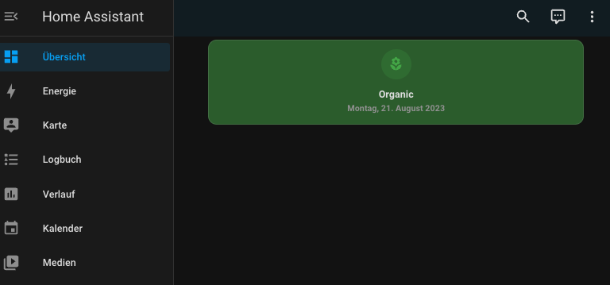
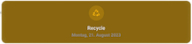

# 🗑️ TrashCard

[![hacs][hacs-badge]][hacs-url]
[![release][release-badge]][release-url]
![downloads][downloads-badge]
![Quality assurance][build-badge]

<a href="https://www.buymeacoffee.com/piitaya" target="_blank"></a>





## Installation

### Pre-Requirements

TrashCard requires [Mushroom][mushroom-url] for Home Assistant to be installed. Please follow the installation instructions of Mushroom. Once you have installed Mushroom you can continue install TrashCard using HACS (prefered) or manually.

<!-- ### HACS

TrashCard is available in [HACS][hacs] (Home Assistant Community Store).

1. Install HACS if you don't have it already
2. Open HACS in Home Assistant
3. Go to "Frontend" section
4. Click button with "+" icon
5. Search for "TrashCard" -->

### Manual

1. Download `trashcrard.js` file from the [latest release][release-url].
2. Put `trashcard.js` file into your `config/www` folder.
3. Add reference to `trashcard.js` in Dashboard. There's two way to do that:
    - **Using UI:** _Settings_ → _Dashboards_ → _More Options icon_ → _Resources_ → _Add Resource_ → Set _Url_ as `/local/trashcard.js` → Set _Resource type_ as `JavaScript Module`.
      **Note:** If you do not see the Resources menu, you will need to enable _Advanced Mode_ in your _User Profile_
    - **Using YAML:** Add following code to `lovelace` section.
        ```yaml
        resources:
            - url: /local/trashcard.js
              type: module
        ```
### Plans

It is planned that TrashCard will be available via HACS in the future.

## Usage

The TrashCard cards can be configured using Dashboard UI editor.

1. In Dashboard UI, click 3 dots in top right corner.
2. Click _Edit Dashboard_.
3. Click Plus button to add a new card.
4. Find one of the _Custom: TrashCard_ card in the list.

## Configuration

All the options are available in the lovelace editor but you can use `yaml` if you want.

| Name                | Type                                                | Default     | Description                                                                         |
| :------------------ | :-------------------------------------------------- | :---------- | :---------------------------------------------------------------------------------- |
| `entity`            | string                                              | Required    | Entity                                                                              |
| `layout`            | string                                              | Optional    | Layout of the card. Vertical, horizontal and default layout are supported           |
| `fill_container`    | boolean                                             | `false`     | Fill container or not. Useful when card is in a grid, vertical or horizontal layout |
| `settings`    | [Settings](#settings)                                            | Required | Settings to detect the kind of trash and how to display |


#### Settings


| Name                | Type                                                | Default     | Description                                                                         |
| :------------------ | :-------------------------------------------------- | :---------- | :---------------------------------------------------------------------------------- |
| `organic`    | [TrashTypeConfig](#trash-type-configuration)       | Required    | Configuration to detect and display that the organic trash is picked up  |
| `paper`      | [TrashTypeConfig](#trash-type-configuration)       | Required    | Configuration to detect and display that the paper trash is picked up |
| `recycle`    | [TrashTypeConfig](#trash-type-configuration)       | Required    | Configuration to detect and display that the organic trash is picked up |
| `waste`      | [TrashTypeConfig](#trash-type-configuration)       | Required    | Configuration to detect and display that the waste trash is picked up |
| `others`     | [OtherConfig](#other-type-trash-configuration)       | Required    | Configuration what should be display if non of the others types are matching |


#### Trash type configuration

| Name                | Type                                                | Default     | Description                                                                         |
| :------------------ | :-------------------------------------------------- | :---------- | :---------------------------------------------------------------------------------- |
| `label`    | string       | Required    | Label which should be shown  |
| `icon`      | string       | Required    | Icon which should be displayed  |
| `color`    | string       | Required    | Background color of the card which should be used |
| `pattern`      | string       | Required    | Pattern used to detected to display the apply this trash type. (Is tested against the calendar entry title) 

#### Other type trash configuration

| Name                | Type                                                | Default     | Description                                                                         |
| :------------------ | :-------------------------------------------------- | :---------- | :---------------------------------------------------------------------------------- |
| `icon`      | string       | Required    | Icon which should be displayed  |
| `color`    | string       | Required    | Background color of the card which should be used |


### Example YAML configuration

```yaml
type: custom:trash-card
entity: calendar.mags_abfuhrtermine
layout: vertical
settings:
  others:
    color: purple
    icon: mdi:trash-can
  organic:
    label: Organic
    icon: mdi:flower
    color: green
    pattern: (braun)
  paper:
    label: Paper
    icon: mdi:newspaper-variant-multiple
    color: blue
    pattern: (blau)
  recycle:
    label: Recycle
    icon: mdi:recycle-variant
    color: amber
    pattern: (gelb)
  waste:
    label: Trash
    icon: mdi:trash-can-outline
    color: grey
    pattern: (grau)
``````


## Thanks

Thanks go to the team at [Mushroom][mushroom-url] for creating many beautiful cards.


<!-- Badges -->
[hacs-url]: https://github.com/hacs/integration
[hacs-badge]: https://img.shields.io/badge/hacs-default-orange.svg?style=flat-square
[release-badge]: https://img.shields.io/github/v/release/idaho/hassio-trash-card?style=flat-square
[downloads-badge]: https://img.shields.io/github/downloads/idaho/hassio-trash-card/total?style=flat-square
[build-badge]: https://img.shields.io/github/actions/workflow/status/idaho/hassio-trash-card/qa.yml?label=Quality%20assurance&style=flat-square

<!-- References -->
[mushroom-url]: https://github.com/piitaya/lovelace-mushroom
[home-assistant]: https://www.home-assistant.io/
[home-assitant-theme-docs]: https://www.home-assistant.io/integrations/frontend/#defining-themes
[hacs]: https://hacs.xyz
[ui-lovelace-minimalist]: https://ui-lovelace-minimalist.github.io/UI/
[release-url]: https://github.com/idaho/hassio-trash-card/releases